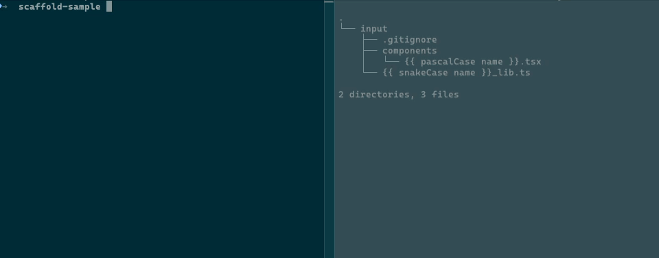

<h1 align="center">Simple Scaffold</h1>

<h2 align="center">

[GitHub](https://github.com/chenasraf/simple-scaffold) |
[Documentation](https://casraf.blog/simple-scaffold) |
[NPM](https://npmjs.com/package/simple-scaffold) | [casraf.blog](https://casraf.blog)

</h2>
Generate any set of files in the easiest way possible with simple commands.

It is completely agnostic and un-opinionated so you can use it for anything from a few simple files
to an entire app boilerplate setup.

Simply organize your commonly-created files in their **original structure**, and running Simple
Scaffold will copy the files to the output path, while replacing values (such as component or app
name, or other custom data) inside the paths or contents of the files using Handlebars.js syntax.

<div align="center">



</div>

<br />

<details>
  <summary>Table of contents</summary>

- [Install](#install)
- [Command Line Interface (CLI)](#command-line-interface-cli)
  - [Available flags](#available-flags)
- [Node module](#node-module)
  - [Node-specific options](#node-specific-options)
- [Preparing files](#preparing-files)
  - [Template files](#template-files)
  - [Variable/token replacement](#variabletoken-replacement)
  - [Helpers](#helpers)
    - [Built-in Helpers](#built-in-helpers)
      - [Capitalization Helpers](#capitalization-helpers)
      - [Date helpers](#date-helpers)
    - [Custom Helpers](#custom-helpers)
- [Examples](#examples)
  - [Run](#run)
    - [Command Example](#command-example)
    - [Node Module Example](#node-module-example)
  - [Files](#files)
    - [Input](#input)
    - [Output](#output)
- [Contributing](#contributing)

</details>

---

## Install

You can either use it as a command line tool or import into your own code and run from there.

```bash
# npm
npm install [-g] simple-scaffold
# yarn
yarn [global] add simple-scaffold
# run without installing
npx simple-scaffold@latest <...args>
```

## Command Line Interface (CLI)

### Available flags

The following is the help text from the `simple-scaffold` binary. To see this and more information
anytime, add the `-h` or `--help` flag to your call, e.g. `npx simple-scaffold@latest -h`.

```text
Usage: simple-scaffold [options]

Create structured files based on templates.

Options:

  --help|-h                       Display help information

  --name|-n                       Name to be passed to the generated files. {{name}}
                                  and {{Name}} inside contents and file names will be
                                  replaced accordingly.

  --output|-o                     Path to output to. If --create-sub-folder is enabled,
                                  the subfolder will be created inside this path.
                                  (default: current dir)

  --templates|-t                  Template files to use as input. You may provide
                                  multiple files, each of which can be a relative or
                                  absolute path, or a glob pattern for multiple file
                                  matching easily.

  --overwrite|-w                  Enable to override output files, even if they already
                                  exist. (default: false)

  --data|-d                       Add custom data to the templates. By default, only
                                  your app name is included.

  --create-sub-folder|-s          Create subfolder with the input name (default: false)

  --sub-folder-name-helper|-sh    Default helper to apply to subfolder name when using
                                  `--create-sub-folder true`.

  --quiet|-q                      Suppress output logs (Same as --verbose 0)
                                  (default: false)

  --verbose|-v                    Determine amount of logs to display. The values are:
                                  0 (none) | 1 (debug) | 2 (info) | 3 (warn) | 4
                                  (error). The provided level will display messages of
                                  the same level or higher. (default:
                                  2)

  --dry-run|-dr                   Don't emit files. This is good for testing your
                                  scaffolds and making sure they don't fail, without
                                  having to write actual file contents or create
                                  directories. (default: false)
```

You can also add this as a script in your `package.json`:

```json
{
  "scripts": {
    "scaffold": "npx simple-scaffold@latest -t scaffolds/component/**/* -o src/components -d '{\"myProp\": \"propName\", \"myVal\": 123}'"
  }
}
```

## Node module

You can also build the scaffold yourself, if you want to create more complex arguments or scaffold
groups - simply pass a config object to the Scaffold function when you are ready to start.

The config takes similar arguments to the command line:

```typescript
import Scaffold from "simple-scaffold"

const config = {
  name: "component",
  templates: [path.join(__dirname, "scaffolds", "component")],
  output: path.join(__dirname, "src", "components"),
  createSubFolder: true,
  subFolderNameHelper: "upperCase"
  data: {
    property: "value",
  },
  helpers: {
    twice: (text) => [text, text].join(" ")
  },
  beforeWrite: (content, rawContent, outputPath) => content.toString().toUpperCase()
}

const scaffold = Scaffold(config)
```

### Node-specific options

In addition to all the options available in the command line, there are some Node/JS-specific
options available:

| Option        | Type                                                                                                                                   | Description                                                                                                                                                                                                                                                                                                             |
| ------------- | -------------------------------------------------------------------------------------------------------------------------------------- | ----------------------------------------------------------------------------------------------------------------------------------------------------------------------------------------------------------------------------------------------------------------------------------------------------------------------- |
| `output`      |                                                                                                                                        | In addition to being passed the same as CLI, it may also be passed a function for each input file to output into a dynamic path: `{ output: (fullPath, baseDir, baseName) => path.resolve(baseDir, baseName) }`                                                                                                         |
| `helpers`     | `Record<string, (string) => string>`                                                                                                   | Helpers are simple functions that transform your `data` variables into other values. See [Helpers](#helpers) for the list of default helpers, or add your own to be loaded into the template parser.                                                                                                                    |
| `beforeWrite` | `(content: Buffer, rawContent: Buffer, outputPath: string) => Promise<String \| Buffer \| undefined> \| String \| Buffer \| undefined` | Supply this function to override the final output contents of each of your files, allowing you to add more pre-processing to your generator pipeline. The return value of this function will replace the output content of the respective file, which you may discriminate (if needed) using the `outputPath` argument. |

## Preparing files

### Template files

Put your template files anywhere, and fill them with tokens for replacement.

Each template (not file) in the config array is parsed individually, and copied to the output
directory. If a single template path contains multiple files (e.g. if you use a folder path or a
glob pattern), the first directory up the tree of that template will become the base inside the
defined output path for that template, while copying files recursively and maintaining their
relative structure.

Examples:

> In the following examples, the config `name` is `AppName`, and the config `output` is `src`.

| Input template                | Files in template                                      | Output path(s)                                               |
| ----------------------------- | ------------------------------------------------------ | ------------------------------------------------------------ |
| `./templates/{{ name }}.txt`  | `./templates/{{ name }}.txt`                           | `src/AppName.txt`                                            |
| `./templates/directory`       | `outer/{{name}}.txt`,<br />`outer2/inner/{{name}}.txt` | `src/outer/AppName.txt`,<br />`src/outer2/inner/AppName.txt` |
| `./templates/others/**/*.txt` | `outer/{{name}}.jpg`,<br />`outer2/inner/{{name}}.txt` | `src/outer2/inner/AppName.txt`                               |

### Variable/token replacement

Scaffolding will replace `{{ varName }}` in both the file name and its contents and put the
transformed files in the output directory.

The data available for the template parser is the data you pass to the `data` config option (or
`--data` argument in CLI).

For example, using the following command:

```bash
npx simple-scaffold@latest \
  --templates templates/components/{{name}}.jsx \
  --output src/components \
  --create-sub-folder true \
  MyComponent
```

Will output a file with the path:

```text
<working_dir>/src/components/MyComponent.jsx
```

The contents of the file will be transformed in a similar fashion.

Your `data` will be pre-populated with the following:

- `{{Name}}`: PascalCase of the component name
- `{{name}}`: raw name of the component as you entered it

> Simple-Scaffold uses [Handlebars.js](https://handlebarsjs.com/) for outputting the file contents.
> Any `data` you add in the config will be available for use with their names wrapped in `{{` and
> `}}`. Other Handlebars built-ins such as `each`, `if` and `with` are also supported, see
> [Handlebars.js Language Features](https://handlebarsjs.com/guide/#language-features) for more
> information.

### Helpers

#### Built-in Helpers

Simple-Scaffold provides some built-in text transformation filters usable by Handlebars.

For example, you may use `{{ snakeCase name }}` inside a template file or filename, and it will
replace `My Name` with `my_name` when producing the final value.

##### Capitalization Helpers

| Helper name  | Example code            | Example output |
| ------------ | ----------------------- | -------------- |
| [None]       | `{{ name }}`            | my name        |
| `camelCase`  | `{{ camelCase name }}`  | myName         |
| `snakeCase`  | `{{ snakeCase name }}`  | my_name        |
| `startCase`  | `{{ startCase name }}`  | My Name        |
| `kebabCase`  | `{{ kebabCase name }}`  | my-name        |
| `hyphenCase` | `{{ hyphenCase name }}` | my-name        |
| `pascalCase` | `{{ pascalCase name }}` | MyName         |
| `upperCase`  | `{{ upperCase name }}`  | MY NAME        |
| `lowerCase`  | `{{ lowerCase name }}`  | my name        |

##### Date helpers

| Helper name                      | Description                                                      | Example code                                                     | Example output     |
| -------------------------------- | ---------------------------------------------------------------- | ---------------------------------------------------------------- | ------------------ |
| `now`                            | Current date with format                                         | `{{ now "yyyy-MM-dd HH:mm" }}`                                   | `2042-01-01 15:00` |
| `now` (with offset)              | Current date with format, and with offset                        | `{{ now "yyyy-MM-dd HH:mm" -1 "hours" }}`                        | `2042-01-01 14:00` |
| `date`                           | Custom date with format                                          | `{{ date "2042-01-01T15:00:00Z" "yyyy-MM-dd HH:mm" }}`           | `2042-01-01 15:00` |
| `date` (with offset)             | Custom date with format, and with offset                         | `{{ date "2042-01-01T15:00:00Z" "yyyy-MM-dd HH:mm" -1 "days" }}` | `2041-31-12 15:00` |
| `date` (with date from `--data`) | Custom date with format, with data from the `data` config option | `{{ date myCustomDate "yyyy-MM-dd HH:mm" }}`                     | `2042-01-01 12:00` |

Further details:

- We use [`date-fns`](https://date-fns.org/docs/) for parsing/manipulating the dates. If you want
  more information on the date tokens to use, refer to
  [their format documentation](https://date-fns.org/docs/format).

- The date helper format takes the following arguments:

  ```typescript
  (
    date: string,
    format: string,
    offsetAmount?: number,
    offsetType?: "years" | "months" | "weeks" | "days" | "hours" | "minutes" | "seconds"
  )
  ```

- **The now helper** (for current time) takes the same arguments, minus the first one (`date`) as it
  is implicitly the current date.

#### Custom Helpers

You may also add your own custom helpers using the `helpers` options when using the JS API (rather
than the CLI). The `helpers` option takes an object whose keys are helper names, and values are the
transformation functions. For example, `upperCase` is implemented like so:

```typescript
config.helpers = {
  upperCase: (text) => text.toUpperCase(),
}
```

All of the above helpers (built in and custom) will also be available to you when using
`subFolderNameHelper` (`--sub-folder-name-helper`/`-sh`) as a possible value.

> To see more information on how helpers work and more features, see
> [Handlebars.js docs](https://handlebarsjs.com/guide/#custom-helpers).

## Examples

### Run

#### Command Example

```bash
simple-scaffold MyComponent \
    -t project/scaffold/**/* \
    -o src/components \
    -d '{"className": "myClassName"}'
    MyComponent
```

#### Node Module Example

```typescript
import Scaffold from "simple-scaffold"

async function main() {
  await Scaffold({
    name: "MyComponent",
    templates: ["project/scaffold/**/*"],
    output: ["src/components"],
    data: {
      className: "myClassName",
    },
  })
  console.log("Done.")
}
```

### Files

#### Input

Input file path:

```text
project → scaffold → {{Name}}.js → src → components
```

Input file contents:

```typescript
import React from 'react'

export default {{camelCase name}}: React.FC = (props) => {
  return (
    <div className="{{className}}">{{camelCase name}} Component</div>
  )
}
```

#### Output

Output file path:

- With `createSubFolder = false` (default):

  ```text
  project → src → components → MyComponent.js
  ```

- With `createSubFolder = true`:

  ```text
  project → src → components → MyComponent → MyComponent.js
  ```

- With `createSubFolder = true` and `subFolderNameHelper = 'upperCase'`:

  ```text
  project → src → components → MYCOMPONENT → MyComponent.js
  ```

Output file contents:

```typescript
import React from 'react'

export default MyComponent: React.FC = (props) => {
  return (
    <div className="myClassName">MyComponent Component</div>
  )
}
```

## Contributing

I am developing this package on my free time, so any support, whether code, issues, or just stars is
very helpful to sustaining its life. If you would like to donate a bit to help keep the project
alive, I would be very thankful!

<a href='https://ko-fi.com/casraf' target='_blank'>
  
</a>

I welcome any issues or pull requests on GitHub. If you find a bug, or would like a new feature,
don't hesitate to open an appropriate issue and I will do my best to reply promptly.

If you are a developer and want to contribute code, here are some starting tips:

1. Fork this repository
2. Run `yarn install`
3. Run `yarn dev` to start file watch mode
4. Make any changes you would like
5. Create tests for your changes
6. Update the relevant documentation (readme, code comments, type comments)
7. Create a PR on upstream

Some tips on getting around the code:

- Use `yarn dev` for development - it runs TypeScript compile in watch mode, allowing you to make
  changes and immediately be able to try them using `yarn cmd`.
- Use `yarn build` to build the output
- Use `yarn test` to run tests
- Use `yarn cmd` to use the CLI feature of Simple Scaffold from within the root directory, enabling
  you to test different behaviors. See `yarn cmd -h` for more information.

  > This requires an updated build, and does not trigger one itself. From here you have several
  > options:
  >
  > - Run `yarn dev` to watch and build automatically
  > - Run `yarn build` before running this
  > - Run `yarn build-cmd` which triggers a build right before running `yarn cmd` automatically with
  >   the rest of the given arguments.

- Use `yarn build-docs` to build the documentation once
- Use `yarn watch-docs` to start docs in watch mode
- To see the documentation, currently you have to serve the directory yourself with a static web
  server (like node's built in serve, VS code's "Go Live" mode, etc)
